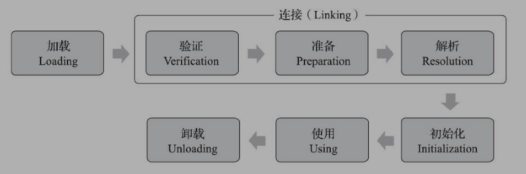

## Java 类加载

1.  加载/验证/准备/初始化/卸载这5个阶段的顺序是确定的,类型的加载过程必须按照这种顺序开始,**解析阶段则在某些情况下可以在初始化阶段开始后再开始,这是为了支持Java语言的运行时绑定特性(也称为动态绑定或晚期绑定)**,这些阶段通常是互相交叉的混合进行

2.  《Java虚拟机规范》**规定有且只有六种情况必须立即对类进行初始化(主动引用)**

    1.  遇到new / getstatic / putstatic / invokestatic这四条字节码指令时,如果类型没有进行过初始化,则需要先触发初始化阶段,生成这四条指令的典型场景:
        1.  使用new关键字实例化对象时
        2.  读取或设置一个类型的静态字段时(被final修饰 / 已在编译期把结果放入常量池的静态字段除外)
        3.  调用一个类型的静态方法时
    2.  使用java.lang.reflect包的方法对类型进行反射调用时,如果类型没有进行过初始化,则需要先触发其初始化
    3.  当初始化类的时候,如果发现父类还没有进行过初始化,则需要先触发父类的初始化; **当一个接口在初始化时,并不要求其父接口全部都完成了初始化,只有在真正使用到父接口的时候才会初始化**
    4.  当虚拟机启动时,用户需要指定一个要执行的主类(包含main()方法的那个类),虚拟机会先初始化这个主类
    5.  当使用JDk7新加入的动态语言支持时,如果一个java.lang.invoke.MethodHandle实例最后的解析结果为REF_getStatic / REF_putStatic / REF_invokeStatic / REF_newInvokeSpecial四种类型的方法句柄,并且这个方法句柄对应的类没有进行过初始化,则需要先触发其初始化
    6.  当一个接口中定义了JDK8新加入的默认方法时,如果有这个接口的实现类发生了初始化,那该接口要在其之前被初始化

3.  类加载过程

    1.  加载

        1.  非数组类加载过程
            1.  通过一个类的全限定名获取定义此类的二进制字节流
            2.  将字节流所代表的静态存储结构转化为方法区的运行时数据结构
            3.  在内存中生成一个代表这个类的java.lang.Class对象,作为方法区这个类的各种数据的访问入口
        2.  数组类加载过程
            1.  组件类型是引用类型: 递归使用上述加载过程加载这个组件类型,数组将被标识在加载该组件类型的类加载器的类名称空间上
            2.  组件类型不是引用类型: 将数组标记为与引导类加载器关联
        3.  数组类的可访问性与它的组件类型的可访问性一致,如果组件类型不是引用类型,数组类的可访问性默认为public,可被所有的类和接口访问到

    2.  验证

        1.  验证阶段确保Class文件的字节流中包含的信息符合《Java虚拟机规范》的全部约束要求,保证这些信息被当作代码运行后不会危害虚拟机本身的安全
        2.  验证的4个阶段
            1.  文件格式验证: 验证字节流是否符合Class文件格式的规范,并且能被当前版本的虚拟机处理,如:
                1.  是否以0xCAFFBABE开头
                2.  主次版本号是否在当前虚拟机接受范围之类
            2.  元数据验证: 对字节码描述的信息进行语义分析,保证其描述的信息符合《Java虚拟机规范》的要求(主要是对类的元数据信息进行语义校验),如:
                1.  是否有父类
                2.  是否继承了不允许被继承的类
            3.  字节码验证: 通过数据流分析和控制流分析确定程序语义是合法的,符合逻辑的(对类的方法体(Class文件中的Code属性)进行经验分析),保证被校验类的方法在运行时不会做出危害虚拟机安全的行为,如:
                1.  保证任何跳转指令都不会跳转到方法体以外的字节码指令上
            4.  符号引用验证: 校验该类是否缺少或者被禁止访问它依赖的某些外部类/方法/字段等资源,确保解析行为能正常执行,如:
                1.  符号应用中通过字符串描述的全限定名是否能找到对应的类
                2.  **可能抛出异常如: java.lang.NoSuchFieldError / java.lang.NoSuchMethodError等**

    3.  准备
    
        1.  为类中定义的变量(静态变量,被static修饰的变量)分类内存并设置类变量初始值
    
    4.  解析
    
        1.  Java虚拟机将常量池内的符号引用替换为直接引用
            1.  符号引用
                1.  **符号引用与虚拟机实现的内存布局无关,引用的目标并不一定是已经加载到虚拟机内存中的内容,虚拟机能接受的符号引用必须都是一致的,因为符号引用的字面量形式明确定义在《Java虚拟机规范》的Class文件格式中**
            2.  直接引用
                1.  是可以直接指向目标的指针/相对偏移量或者是一个能间接定位到目标的句柄
                2.  **直接引用与虚拟机实现的内存布局直接相关**,如果有了直接引用,那**引用的目标必定在虚拟机中的内存中存在**
    
    5.  初始化
    
        1.  执行类构造器&lt;clinit&gt;()方法
        2.  如果一个类中没有对静态变量赋值也没有静态语句块,那么编译器可以不为这个类生成&lt;clinit&gt;()方法
        3.  &lt;clinit&gt;()方法是由编译器自动收集类中的所有类变量的赋值动作和静态语句块中的语句合并产生的,**顺序由语句在源文件中出现的顺序决定**
        4.  **静态语句块中只能访问到定义在静态语句块之前的变量,定义在之后的变量,在之前的静态语句块可以赋值,但是不能访问**
        5.  虚拟机会保证在子类的&lt;clinit&gt;()方法方法执行前,父类的&lt;clinit&gt;()方法已经执行完毕(父类中定义的静态语句块要优先于子类的变量赋值操作)
        6.  虚拟机必须保证一个类的&lt;clinit&gt;()方法在多线程环境中被正确的加锁同步,**如果有多个线程同时去初始化,只有一个线程去执行&lt;clinit&gt;()方法,其他线程都阻塞等待**
        7.  不会执行类初始化的情况:
            1.  通过子类引用父类的静态字段,只会触发父类的初始化,而不会触发子类的初始化
            2.  定义对象数组,不会触发该类的初始化
            3.  常量在编译期间会存入调用类的常量池中,本质上并没有直接引用定义常量的类,不会触发常量所在的类
            4.  通过类名获取Class对象,不会触发类的初始化
            5.  通过Class.forName加载指定类时,如果指定参数initialize为false,也不会触发初始化,这个参数是告诉虚拟机是否要对类进行初始化
            6.  通过ClassLoader默认的loadClass方法,也不会触发初始化动作
        
        
    
    